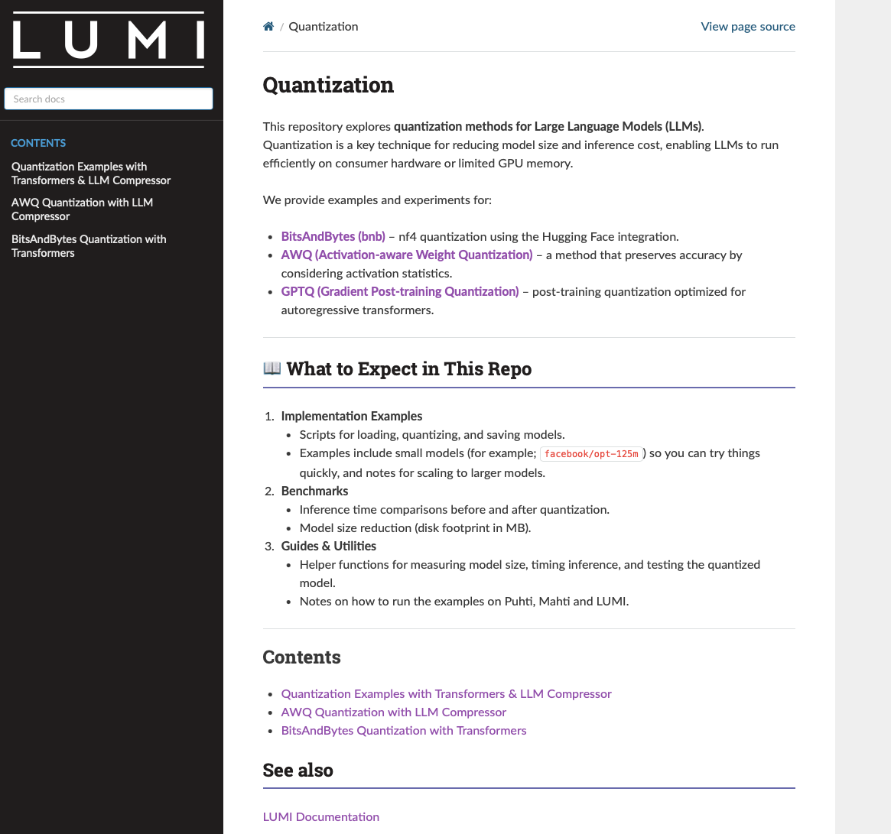

WARNING: This repo is in development stage. 

## Sphinx Deployment of Webpage

This repo contain information about sphinx deployment of github into a webpage. Instractuion folder has all relevant information about how to run it. 

Please read [Instructions]([https://example.com](https://github.com/mahnoormahnoorr/sphinx_deployment_of_webpages/tree/main/Instructions) very carefully. 

When you run this command `sphinx-quickstart docs` it creates files within docs folder: build, make.bat, Makefile, source. 

Build will be the empty folder where files will store up after you run the webpage. For-example if you deploy webpage, 2 folders named as `doctress` and `html` will open in Build that will have other files and sub folder in it. `html` folder is very important in terms of deploying webpage from github to make it public. For private usage,  `open docs/build/html/index.html` will open up the webpage. 

Source is the folder where you put all relevant files that you need in your webpage. 

## Deployment Through Github

Copy your `html` folder from `docs/build/html` to `docs/`. The Docs should look like this: 


```bash
docs/
├── index.html        ✅ from build/html
├── _static/          ✅ from build/html
├── _sources/         ✅ from build/html
├── search.html       ✅ from build/html
├── .nojekyll         ✅ you create this
└── source/           ← your Sphinx source (already there)

```

Go to Settings → Pages, 
Under Source:
  Branch: main
  Folder: /docs
Save

Your site will be live. 


